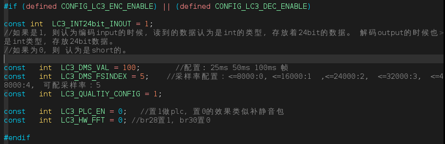
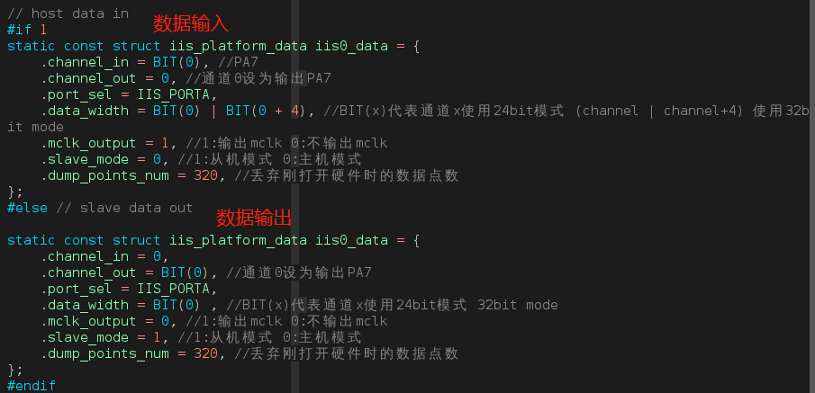

# LC3编解码功能说明

> 本说明通过iis传输音频数据,介绍了LC3功能：包括编码与解码。
>

---

## 适用平台

> 本工程适用以下芯片类型：
>
> 1. AC79系列芯片：AC790N、AC791N

> 杰理芯片和评估板的更多信息可在以下地址获取：
> [链接](https://shop321455197.taobao.com/?spm=a230r.7195193.1997079397.2.2a6d391d3n5udo)

## 工程配置说明

> 1.app.config.h:
>
> - 打开宏#define CONFIG_LC3_ENC_ENABLE
> - 打开宏#define CONFIG_LC3_DEC_ENABLE
>
> 
>
> 2.audio_config.c：音频LC3参数配置
>
> 
>
> 3. board.c 板级配置(iis的配置)
>
> - 其中, .data_width : BIT(x)代表通道x使用24bit模式 (x | x+4) 使用32bit mode
>
> 
>

---

## 操作说明：

>编译工程，烧录镜像，复位启动

>系统启动后，可以通过串口软件看到测试的打印信息

> JIELI SDK的编译、烧写等操作方式的说明可在以下文档获取：
> [文档](/doc/stuff/usb%20updater.pdf)

### 代码流程

>
---

## 常见问题

> * 

## 参考文档

> * N/A